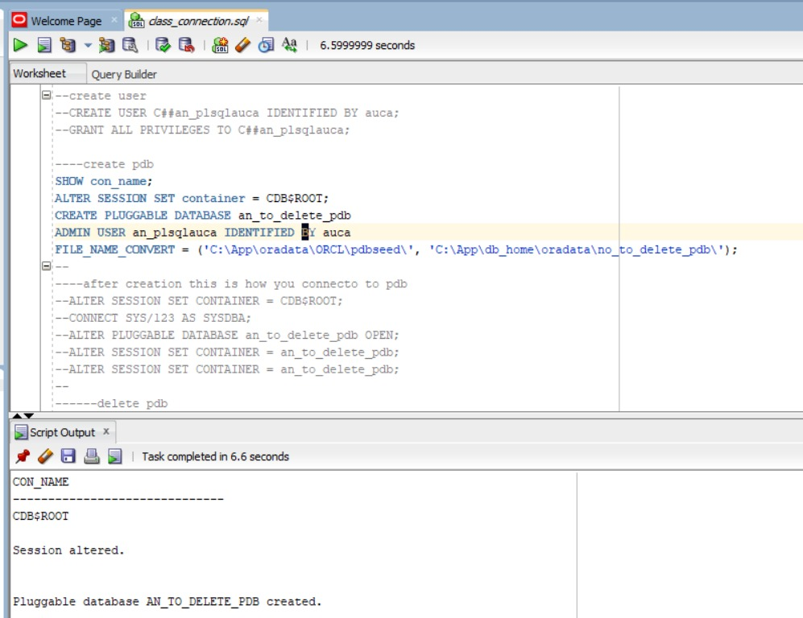
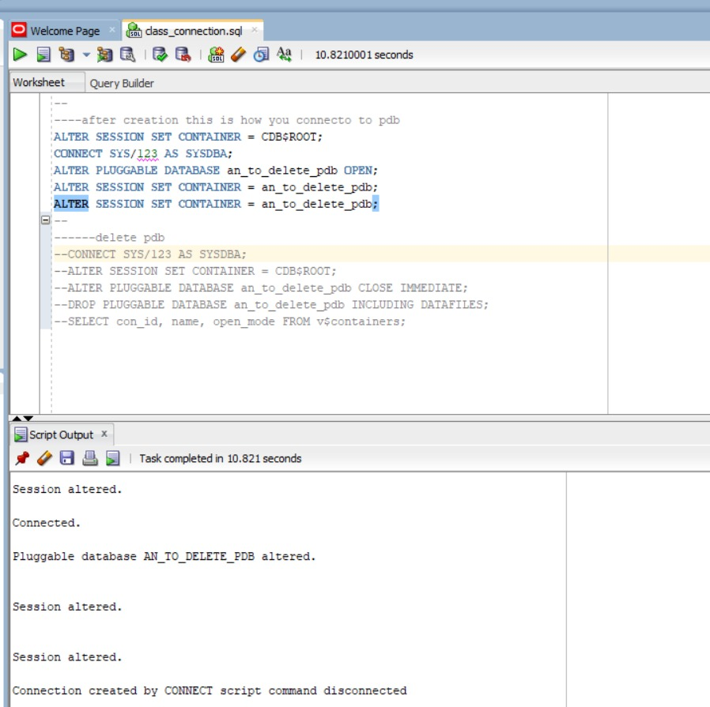
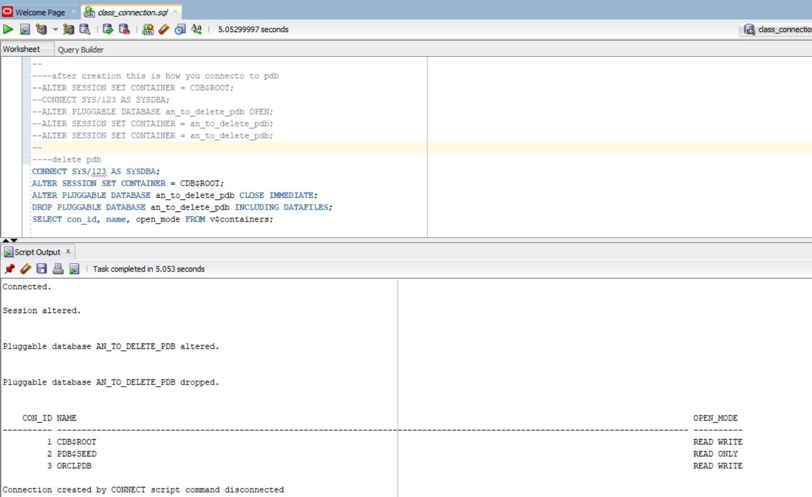
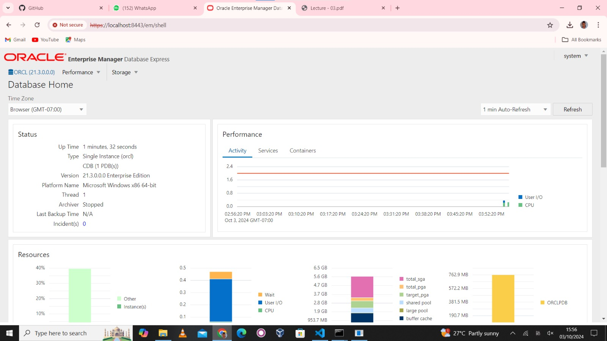

# Oracle PDB Management with PL/SQL
This README provides a guide to create, manage, and delete a Pluggable Database (PDB) using Oracle Database commands.

**Prerequisites**

Ensure you have:

- Oracle Database installed with access to a Container Database (CDB).
- SYSDBA privileges.

## 1. Create a New User
The following command creates a new user named C##an_plsqlauca and grants all privileges to the user:
```sql
CREATE USER C##an_plsqlauca IDENTIFIED BY auca;
GRANT ALL PRIVILEGES TO C##an_plsqlauca;
```

## 2. Create a Pluggable Database (PDB)
To create a new PDB, follow these steps:

1. Show the Current Container Name:
```sql
SHOW con_name;
``````
2. Switch to the CDB$ROOT Container:
```sql
ALTER SESSION SET container = CDB$ROOT;
```
3. Create a Pluggable Database: The following command creates a new pluggable database called an_to_delete_pdb:
```sql
CREATE PLUGGABLE DATABASE an_to_delete_pdb
ADMIN USER an_plsqlauca IDENTIFIED BY auca
FILE_NAME_CONVERT = ('C:\App\oradata\ORCL\pdbseed\', 'C:\App\db_home\oradata\no_to_delete_pdb\');
```

## 3. Connect to the Pluggable Database (PDB)
After the PDB is created, you need to connect and open it:

1. Switch to the Root Container:
```sql
ALTER SESSION SET CONTAINER = CDB$ROOT;
```
2. Connect as SYSDBA:
```sql
CONNECT SYS/123 AS SYSDBA;
```
3. Open the Pluggable Database:
```sql
ALTER PLUGGABLE DATABASE an_to_delete_pdb OPEN;
```
4. Set the Current Container to the Newly Created PDB:
```sql
ALTER SESSION SET CONTAINER = an_to_delete_pdb;
```

## 4. Delete the Pluggable Database (PDB)
If you want to delete the PDB, follow these steps:

1. Connect as SYSDBA:
```sql
CONNECT SYS/123 AS SYSDBA;
```
2. Switch to the Root Container:
```sql
ALTER SESSION SET CONTAINER = CDB$ROOT;
```
3. Close the PDB:
```sql
ALTER PLUGGABLE DATABASE an_to_delete_pdb CLOSE IMMEDIATE;
```
4. Drop the PDB (Including Datafiles):
```sql
DROP PLUGGABLE DATABASE an_to_delete_pdb INCLUDING DATAFILES;
```
5. Verify that the PDB has been deleted: You can use the following query to check the status of containers:
```sql
SELECT con_id, name, open_mode FROM v$containers;
```



## 5. Oracle Enterprise Manager

